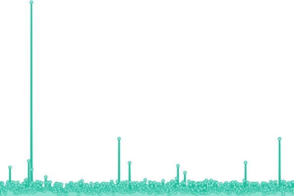
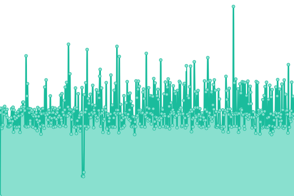
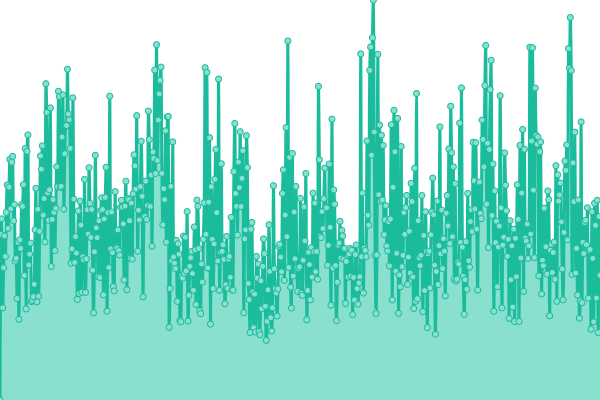
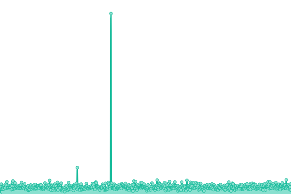

# [📈 Live Status](https://Yo-codeback|鹿中創客.github.io/bvc-status): <!--live status--> **🟧 Partial outage**

This repository contains the open-source uptime monitor and status page for [Yo-codeback|鹿中創客](https://Yo-codeback|鹿中創客.github.io/bvc-status), powered by [Upptime](https://github.com/upptime/upptime).

With [Upptime](https://upptime.js.org), you can get your own unlimited and free uptime monitor and status page, powered entirely by a GitHub repository. We use [Issues](https://github.com/Yo-codeback |　鹿中創客/bvc-status/issues) as incident reports, [Actions](https://github.com/Yo-codeback|鹿中創客/bvc-status/actions) as uptime monitors, and [Pages](https://Yo-codeback|鹿中創客.github.io/bvc-status) for the status page.

<!--start: status pages-->
<!-- This summary is generated by Upptime (https://github.com/upptime/upptime) -->
<!-- Do not edit this manually, your changes will be overwritten -->
<!-- prettier-ignore -->
| URL | Status | History | Response Time | Uptime |
| --- | ------ | ------- | ------------- | ------ |
|  [our_api 主要農業部資料 (主資料來源)](https://bvc-api.deno.dev) | 🟩 Up | [our-api.yml](https://github.com/Yo-codeback/bvc-status/commits/HEAD/history/our-api.yml) | 

 655ms
     
 | 

<a href="https://Yo-codeback.github.io/bvc-status/history/our-api">100.00%</a>
    

|  [backup1 備用農業部資料 (主資料來源2)](http://hk-a.w.creeperdev.me:10007) | 🟥 Down | [backup1-2.yml](https://github.com/Yo-codeback/bvc-status/commits/HEAD/history/backup1-2.yml) | 

 0ms
     
 | 

<a href="https://Yo-codeback.github.io/bvc-status/history/backup1-2">0.00%</a>
    

|  [moa_api 農業部資料 (副資料來源)](https://data.moa.gov.tw/Service/OpenData/FromM/FarmTransData.aspx) | 🟥 Down | [moa-api.yml](https://github.com/Yo-codeback/bvc-status/commits/HEAD/history/moa-api.yml) | 

 22844ms
     
 | 

<a href="https://Yo-codeback.github.io/bvc-status/history/moa-api">88.92%</a>
    

|  [notify_api 通知頁面 (通知內容)](https://bvcaanotify.deno.dev) | 🟩 Up | [notify-api.yml](https://github.com/Yo-codeback/bvc-status/commits/HEAD/history/notify-api.yml) | 

 230ms
     
 | 

<a href="https://Yo-codeback.github.io/bvc-status/history/notify-api">100.00%</a>
    

<!--end: status pages-->

[**Visit our status website →**](https://Yo-codeback |　鹿中創客.github.io/bvc-status)

## 📄 License

- Powered by: [Upptime](https://github.com/upptime/upptime)
- Code: [MIT](./LICENSE) © [Anand Chowdhary](https://anandchowdhary.com), supported by [Pabio](https://pabio.com)
- Data in the `./history` directory: [Open Database License](https://opendatacommons.org/licenses/odbl/1-0/)
